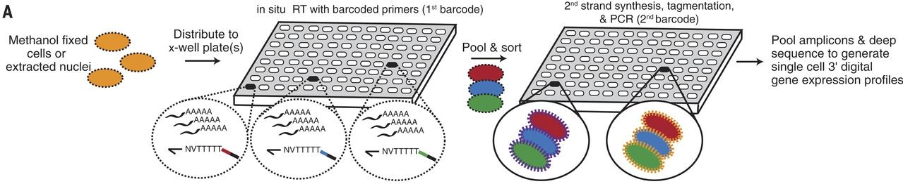

```{r setup, include=FALSE}
knitr::opts_chunk$set(echo = TRUE)

# set as working directory the directory where this source file is in
setwd(dirname(rstudioapi::getActiveDocumentContext()$path))
```

# Introduction

This document contains the code to reproduce **Figure 1F** from *Comprehensive single-cell transcriptional profiling of a multicellular organism, Cao et.al. (Science, 2017)*.

**Context:** The figure is created in the optimization process of the sci-RNA-seq method. Most single-cell RNA sequencing methods rely on isolating individual cells within physical compartments, which is expensive and linearly increases the cost of profiling higher numbers of cells. Single-cell combinatorial indexing ("sci") removes the need to isolate individual cells, facilitating scalability (Figure 1). In this study, combinatorial indexing is used to label the transcriptomes of large numbers of single cells (sci-RNA-seq).

```{r FigMethod, echo=FALSE, fig.cap="Figure 1. Schematic of the sci-RNA-seq workflow (from Figure 1A at Cao et.al., 2017).", out.width = '100%'}

```

To test the validity of sci-RNA-seq, two different cell populations (HEK293T and HeLa S3) are mixed in a co-culture and sci-RNA-seq is used to profile the transcriptome of individual cells. If the method is effective, each cell in the co-culture will cluster with the cells of the same population. If it was not effective, transcriptomes considered from individual cells would really have transcripts from more than one cell and, as a result, some cells would not cluster with the related group. As a control, HEK293T and HeLaS3 cells are cultured in a pure (not mixed) culture and profiled using the same method. To visualize the clusters of individual cells, the 3000 genes with the highest variance are used in Principal Component Analysis (PCA) and the top 10 principal components are reduced to only 2 dimensions with t-SNE. The result is figure 1F (reproduced in Figure 2 here), which is a t-SNE plot of cells originating in wells containing HEK293T (red), HeLa S3 (blue), or a mixture (grey). The result indicates that the cells from the mixed population cluster either with HEK293T or HeLa S3 cells, concluding that **the transcriptomes obtained with sci-RNA-seq belong to an individual cell, so the method is effective without requiring physical isolation of individual cells**.

```{r Fig1F, echo=FALSE, fig.cap="Figure 2. t-SNE of cells in wells with HEK293T (red), HeLa S3 (blue) or mixed (grey) populations (from Figure 1F at Cao et.al., 2017).", out.width = "50%"}

```

The materials and methods section of the article, available as Supplementary Information, provides details on how that figure was created:

*t-SNE visualization of HEK293T cells and HeLa S3 cells:  We visualized the clustering of sci-RNA-seq data from populations of pure HEK293T, pure HeLa S3 and mixed HEK293T + HeLa S3 cells using t-Distributed Stochastic Neighbor Embedding (t-SNE). Cells with more than 100,000 UMIs were discarded. The top 3,000 genes with the highest variance in the digital gene expression matrix for these cells were first given as input to Principal Components Analysis (PCA). The top 10 principal components were then used as the input to t-SNE, resulting in the two-dimensional embedding of the data shown in Fig. 1F.*

Note that raw sequencing reads were previously trimmed according to the barcodes attached during sci-RNA-seq to assign the reads to different cells. Duplicated reads with the same unimolecular identifier (UMI) were also removed. Then,  the reads were mapped to the HEK293T and HeLaS3 genomes to obtain the UMI count for each gene for each cell. This obtained gene expression matrix is the input of the analysis described in the methods section and reproduced in this document.

Briefly, the analysis will involve the following steps:

1. Obtain the gene expression matrix from NCBI GEO.
2. Select only cells assigned to HeLa S3, HEK293F or mixed populations.
3. Remove cells with more than 100,000 UMIs.
4. Select the top 3,000 genes with the highest variance.
5. Use them in Principal Components Analysis (PCA).
6. Use the top 10 principal components explaining more variance for t-distributed stochastic neighbor embedding (t-SNE).

**Note that the analysis reported in the paper were done using Monocle	version	2.3.5, while Monocle v3 is used here.**

# Analysis

## 1. Obtain the gene expression matrix

The digital gene expression matrix with the UMI counts can be obtained from the [NCBI Gene Expression Omnibus (GEO)](https://www.ncbi.nlm.nih.gov/geo/). The data from the reference article can be obtained with the `GSE98561` identifier. The experiment used to generate Figure 1F is the one using 96x96 well plates and multiple cell types, which data can be accessed with the `GSM2599700` identifier.

The `GEOquery` library is used to access NCBI GEO data from `R`.

```{r  message=F, warning=F}
if (!require("GEOquery")){
  BiocManager::install("GEOquery")
}
library("GEOquery")
```

Using the `getGEOSuppFiles` function downloads the raw data associated with the experiment of interest, which in this case is accessed with the `GSM2599700` identifier. This function also returns the `path` of the downloaded file as the `rowname` of an object containing information about the `getGEOSuppFiles` download. The data is already in `RData` format, so it is loaded with `load` after unzipping it with `gzfile`.

```{r cache=T, warning=F, message=F}
downloadInfo <- getGEOSuppFiles("GSM2599700")
filePath <- rownames(downloadInfo)[1] # To obtain the path 
load(gzcon(gzfile(filePath)))
```

The downloaded `RData` file loads two objects in the environment:

- cell_source: 919 observations of 2 variables. The `barcode` variable indicates the barcode sequence assigned to each cell and the `source` variable indicates the cell type. 
- UMI_count: matrix with 226305 rows and 919 columns. Each row corresponds to a transcript and each column to a cell. The values in the matrix are the UMI counts that mapped to each transcript for each cell.

## 2. Select only cells assigned to HeLa S3, HEK293F, or mixed populations.

The experiment contains data for other cell types than those represented in Figure 1F. We want to keep only the information from cells belonging to the mixed HEK293T-HeLa population and the controls of HEK293T or HeLa S3 monocultures. Since the rest of the analysis will be done using the `monocle` library, we build a `Cell Data Set` object with all the data. This format combines UMI counts with cell phenotype information and (optionally) transcript annotation information. Hence, filtering data in this format reduces the risk of accidentally misscrossing information between sources. **Note:** check the `InstallMonocle.R` script to install `Monocle 3` on a fresh R 4.0 installation.

```{r message=F, warning=F}
library(monocle3)
```

```{r warning=F}
cds <- new_cell_data_set(UMI_count, cell_metadata = cell_source)
```

The initial experiment information contains 919 cells belonging to wells with different types of cultures. For Figure 1F, cells from the `293T_3T3_cell` and `293T_3T3_nuclei` are not relevant.

```{r}
table(cds$source)
```
So we create a subset with only the relevant cell types. Note that the mixed population is denoted as `Hela_293T_cell`, and that the numbers obtained match those used in the description of Figure 1F in the reference article (Cao et.al.2017).

```{r}
cdsTyp <- cds[ , (cds$source == "293T_cell" | cds$source == "Hela_cell" | cds$source == "Hela_293T_cell" )]
table(cdsTyp$source)
```

## 3. Remove cells with more than 100,000 UMIs.

To remove the cells with more than 100,000 UMIs, the number of UMIs matching the transcripts for each cell is summed to check if it is below or equal to 100,000. The subset of cells with less than 100,000 UMIs is kept in `cdsInt`. Only a few cells are removed in some categories.

```{r}
cdsInt <- cdsTyp[ , colSums(assay(cdsTyp)) <= 1e5 ]
table(cdsInt$source)
```

## 4. Select the top 3,000 genes with the highest variance.

The `seurat` library has the `FindVariableFeatures` function which simplifies the process of identifying the 3,000 genes with the highest variance. However, with `monocle` there is no function to do that and we need to calculate the variance of each transcript with other functions to select the top 3,000. Since `UMI_count` is large and is given as a sparse matrix, the combination of `apply` and `var` functions to calculate that runs out of memory. The `rowVars` function from the `Matrix` package calculates the variance of each row (transcript) in the matrix.

```{r}
transc_var <- rowVars(as.matrix(assays(cdsInt)$counts))
```

Then, the list of variances is sorted in decreasing order and the row indices of the 3,000 transcripts with higher variance are selected.

```{r}
transc_var_sorted <- sort(transc_var,index.return=TRUE, decreasing=TRUE)
transc_top_var <- transc_var_sorted$ix[1:3000] # select first 3000 transcripts with higher variance
```


## 5. Use them in Principal Components Analysis (PCA)

Principal Component Analysis (PCA) decomposes data in principal componenets so that its variance can be represented with less variables. In this case, the variance of the data is decomposed in only 10 principal components. Only the top 3,000 transcripts with higher variance are used because their row indices are given in the `use_genes` parameter. Note that this works only because transcripts are not annotated in the `UMI_count` matrix and, instead, are named with integers starting at `1`.

```{r}
cdsInt <- preprocess_cds(cdsInt, num_dim=10, method="PCA", use_genes = as.character(transc_top_var))
```

Each principal component explains a percentage of the total variance (Figure 3). Only the first two components account for more than 70\% of the variance.

```{r FigPCA, echo=TRUE, fig.cap="Figure 3. Percentage of variance explained by each principal component."}
plot_pc_variance_explained(cdsInt)
```

## 6. Distribute single cells in two dimensions by t-SNE

t-SNE is a nonlinear dimensionality reduction technique frequently used to visualize high-dimensional data in just a two-dimensional space. In this case, t-SNE represents each cell according to its value of the 10 principal components computed in PCA.

```{r cache=T}
cdsInt <- reduce_dimension(cdsInt, reduction_method = c("tSNE"), max_components=2, preprocess_method="PCA")
```

The resulting figure shows two clusters of cells (Figure 4). The controls of wells with monoclultures of HeLa cells (blue) or HEK293T cells (red) identify each cluster with one or the other population of cells. Cells from the mixed population wells (grey, `Hela_293T_cell`) clearly identify with one or the other cluster. This indicates that the sci-RNA-seq effectively assigns a barcode to each individual cell. Otherwise, we would observe some points from the mixed culture (grey) between both clusters, as their transcriptomes would be the result of the mixture of cells from both populations.

```{r message=F, fig.cap="Figure 4. tSNE plot of cells in wells with HEK293T (red), HeLa S3 (blue) or mixed populations."}
library(ggplot2)
pt <- plot_cells(cdsInt, reduction_method="tSNE", color_cells_by = "source", cell_size=1.5, label_cell_groups=F)
pt + scale_color_manual(values=c("#b71d2c", "#a6a6a6", "#567bb5"))
```

# Conclusion

There are some differences between the graph reproduced in this document and Figure 1F of the reference article. The position of the clusters in the t-SNE plots is clearly different between the article and the document, but this is irrelevant because the directions of the axis are arbitrary and could be inverted if desired. However, in the figure obtained in this document there are three cells from wells with the HeLa population that cluster together with the 293T cells. One possible explanation is a mistake in the subsetting process or labeling of cells. Another possible explanation is a mistake in the variance calculation step done while reproducing the analysis, or using a different monocle version here than in the reference study.

In any case, cells from the mixed population identify with one or the other cluster, indicating that sci-RNA-seq effectively labels individual cells with a unique barcode so that the transcriptome for each cell can be sequenced without requiring physical isolation of individual cells. 